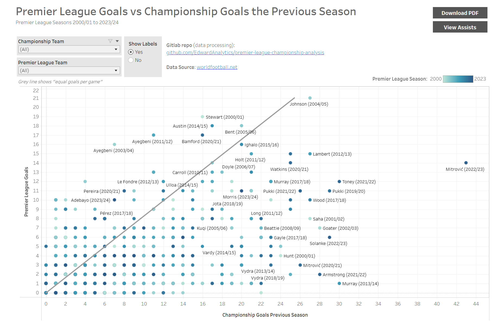

# Premier League Championship Analysis

### Overview
This project investigates the goals scored and assists made by players in the Championship, and compares them to their performance in the Premier League the following season.

### Public Tableau Dashboard Location
[Tableau: Premier League Championship Analysis - Goals and Assists](https://public.tableau.com/app/profile/edwardanalytics/viz/PremierLeagueChampionshipAnalysisGoalsandAssists/Goals)

### Dashboard Preview


### Data Source
worldfootball.net

### Directory structure
```
├── conf
│   └── duplicated_player_names.yaml         # Configuration for managing duplicated player names
│
├── data                                     # Data storage for raw and processed datasets
│   ├── championship_assists                 # Championship assists data files split by season and unioned
│   ├── championship_goals                   # Championship goals data files split by season and unioned
│   ├── premier_league_assists               # Premier League assists data files split by season and unioned
│   ├── premier_league_goals                 # Premier League goals data files split by season and unioned
│   └── premier_league_championship_joined.csv # Joined dataset of Premier League and Championship data
│
├── notebooks                                # Jupyter notebooks for running exploration and processing functions
│   ├── 01_load_pl_championship_data.ipynb   # Notebook to load Premier League and Championship data
│   └── 02_join_pl_championship_data.ipynb   # Notebook to join Premier League and Championship data
│
├── scripts                                  # Above notebooks in python script form
│   ├── join_pl_championship_data.py         # Script to join Premier League and Championship data
│   └── load_pl_championship_data.py         # Script to load Premier League and Championship data
│
├── src                                      # Source code directory for data preparation modules
│   └── data_preperation                     # Data preparation module
│       ├── join_pl_championship_data.py     # Module to join data including filtering and mapping player names
│       └── load_pl_championship_data.py     # Module to load data including scraping
│
└── tests                                    # Directory for test scripts (in development)
```
